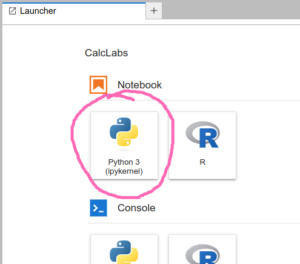

# Intro to Python for Calculus (markdown)

In this section, we'll review some of the elements of core Python that feature in our notebooks.
If you're an experienced Python programmer, you'll no doubt find some omissions and shortcomings in our documentation.
Suggestions are welcome! These labs have been written by mathematicians with no formal training in programming,
and are rather utilitarian in nature.

There's a good chance you're reading this page to remind yourself of some detail as you work through one of the lab notebooks.
But if you're reading this to get accquainted with Python prior to getting started,
you may want to try out some of the operations below.
One of the easiest ways to do this is to have a *Jupyter notebook* open.
If you're a student at the University of Lethbridge, you don't have to install anything!
We have a cloud-based Jupyter *hub* located at [uleth.syzygy.ca](https://uleth.syzygy.ca).
Log in with your University of Lethbridge credentials, and click on the button to open a new Python notebook:



In particular, this page can be opened as an [interactive notebook](./IntrotoPython.ipynb) if you want to try out the code.

## Basic arithmetic operations

One thing to keep in mind, if you're coming from a C++ background, is that most of the time in Python,
we don't need to worry about specifying data types (until we do...)
If you ask Python to perform the sum `4+3`, it will do so, and return 7.
If you ask for `4/3`, you will get a floating point answer, rather than a fraction.
(If you want to get a fraction, see the [SymPy documentation](./sympy.md).)

Basic operations are:

- Addition: `4+3`
- Subtraction: `4-3`
- Multiplication: `4*3`
- Division: `4/3`
- Exponentiation: `4**3` (Caution: Python will not understand `4^3`, even if that's what you're used to.)

It's a good idea to do some playing around; in particular, do some experiments with order of operation,
and determine for yourself when parentheses are (and aren't) needed.
(Of course, a few extra parentheses won't hurt.)

**Note:** one of the most common errors that students run into in their calculus labs is forgetting the multiplication operator.
We're used to writing expressions like `2x` that have an implied multiplication,
but this will not be understood by Python. You must enter `2*x`.

## Variables and print statements

With multi-step calculations, it is often useful to assign variable names.
This is also useful if we want to later change the numbers in our calculuations.

For example, instead of computing the sum `4+3` directly, we could enter the information as follows:
```
a = 4
b = 3
c = a+b
```

If you run this code in a Jupyter code cell, nothing will happen.
Well, nothing that you can see. The computer has stored this information, but you haven't asked it to do anything with it.
If you want to see the result of the addition, you need to use the `print` command:
```
print(c)
```
In a Jupyter notebook, you can also just put `c` as your last line of code, and it will print.

Note that if we put `4+3` in a code cell and run it, we get the output immediately.

You can also declare multiple variables together on the same line:
```
a, b = 4, 3
```

We can store and print string variables in a similar fashion:
```
string_var = "Hey, I'm a string!"
print(string_var)
```
will produce the output `Hey, I'm a string!`.

**Caution**: running an operation like `4+3` will automatically produce output.
But in a Jupyter notebook, this is only true if it's the last (or only) line in your cell.
If you enter
```
4+3
4*3
4-3
```
and run it, the only output you'll get is `1` (the result of doing `4-3`).
If you want to get all three outputs from a single cell, you can use the `print` command.
See what happens if you do:
```
print(4+3)
print(4*3)
print(4-3)
```
You can also enter a list of operations, and the output will be an ordered list:
```
4+3,4*3,4-3
```


## Lists and arrays

Most of the time, we won't be interested in evaluating a function at a single point.
Instead, we'll want to evaluate a function on a whole list of points,
and produce a list of output values as a result.
(These might then be used for something like plotting a graph of the function.)

Most often, we will be working with lists when using the [NumPy library](./numpy.md) for numerical computations.
In that context, the content of our list will be floating point numbers, and the list is called an **array**.
(An array is really just a special type of list, where all the entries have the same data type, which is usually `int` or `float`.
Arrays come from libraries like NumPy and aren't built into Python.)

Lists entries don't have to be of the same type. It's also important to note that a list:
- is *ordered*
- can contain *duplicates*
- can be changed (the Python word for this is *mutable*)

In particular, we can start with an empty list and then populate it.
Some examples:
```
empty_list = []
mixed_list = [1, 3.4, "Hello world", True]
integer_list = [0,1,2,3,4,5,6,7,8,9]
```
Note that lists are always denoted by square brackets.

### Operations with lists

One of the simplest things we can do with a list is get its length.
Try running:
```
print(len(empty_list))
print(len(mixed_list))
```

The `type` command will give the data type of a list, but this is unlikely to be needed in a calculus lab.

The `append` command is quite useful, as this lets us add items to a list.
For example, if we run
```
empty_list = []
empty_list.append(3)
print(empty_list)
```
the output will be `[3]`. 

Often this is done as part of a `for` loop. If we want to append our list 10 times, we can do the following:
```
empty_list = []
for i in range(10):
    empty_list.append(i)
print(empty_list)
```

Again note the importance of the indentation for the `for` loop.
The output of the above will be `[0,1,2,3,4,5,6,7,8,9]`. We asked for 10 steps,
and the computer obliged. But the computer always starts counting at zero!

One of the things we'll need to be able to do is access list items.
Here is some of the syntax for doing so, for a list named `L`:

- the whole list: `L[:]`
- everything after (and including) index position `i`: `L[i:]`
- everything before index position `i`: `L[:i]`
- everything before the position `j` steps from the end: `L[:-j]`
- everything after (and including) the position `j` steps from the end: `L[-j:]`

(For the last two, "from the end" is meant in the sense that one step from the end is the last entry.)

For example, if `L` is a partition of an interval, and we want to do a Riemann sum,
the list `L[1:]` consists of all points in the partition except the first one, which is what you want for right endpoints.
If you want left endpoints, you would use the list `L[:-1]`, which consists of everything except the last point.

We can access individual elements of a list by specifying their index in the list, which **starts at 0** (i.e. the first element is at index 0). 

Here's how we would access (and output) the first three elements of a list `primes`:
```
primes = [2,3,5,7,11,13,17,19]
print(primes[0], primes[1], primes[2])
```

To access elements from the end of a list, we can use negative indices. For instance, `[-1]` would specify the last index of a list.  

Below is how we would access the last two elements of `primes`:
```
print(primes[-2], primes[-1])
```

For more documentation on operations with lists and other sequences in Python (i.e. arrays), see the [Intro to NumPy for Calculus](./numpy.md) page!
And of course, you can find plenty of [help online](https://www.w3schools.com/python/python_lists.asp).

## Functions

A *function* in Python is just like a function in mathematics: you define it by saying what it should do to a given input.
Then, if you give your function an input, it will provide you with the corresponding output.
The syntax for defining a function is as follows:
```
def function_name(parameters):
    # code to be executed
```
Note that the `#` symbol denotes the beginning of a comment.
In a Jupyter notebook you can explain your code in a markdown cell,
but it is still good practice to include comments in your code to explain what various lines are for.

Some important points:
- Functions in Python are defined using the `def` keyword.  
- After the `def` keyword, comes the function's name and then a list of parameters, or inputs, enclosed in `()` and followed by a `:`.  
- Indented below is the function's body, the block of code that executes when you call the function.  
- In the function's body, you could find a `return` statement, this outputs or "returns" a particular value when the function is executed.

For an example of a function, we can define a function of a parameter `x` as follows:

```
def f(x):
    return x**2+4
```

This defines the function $f(x)=x^2+4$. But note that Python will not communicate your function to you in this way.
Indeed, if you try running the command `print(f(x))`, you will get an error, 
since we haven't told the computer what `x` is!
The command `print(f)` is no better: you'll get an output like `<function f at 0x7f27cd037880>` that is probably not very illuminating.

However, your function *has* been defined, and it *will* give you output, as long as you first give it input.
Enter `f(2)` and you'll get the output `8`, which is indeed the value of $2^2+4$.

Below is a function that operates on a list, finding the mean (average) of a list of numbers. It utilizes two built-in functions, `sum()` which returns the sum of a sequence of numbers, and `len()` which returns the length of a sequence of numbers.
```
numbers = [0, 1, 2, 3, 4, 5, 6, 7, 8]

def calculate_mean(list):
    return sum(list) / len(list) # sum adds the entries in the list, and len gives the number of entries  

calculate_mean(numbers)
```

**Note:** the indentation above is an essential part of Python syntax!
Your function definition won't work without it.
Fortunately, when you're working in a Jupyter notebook,
as long as you remember the colon at the end of the first line,
the computer will add the indentation for you as soon as you hit enter.

A quicker way to define a function is to use Python's `lambda` syntax.
This is especially useful if you need to define a function inline as part of a larger program.
Instead of the function definition we did above, an equivalent syntax is:
```
f = lambda x : x**2+4
```
The lambda syntax is faster, but until you get used to it, I'm not sure it is any easier to remember!

In general, the syntax is as follows:

```python
function_name = lambda parameters: return values
```

## Conditional statements

There are instances that arise in programming when we only want to execute a particular block of code if a certain condition is true. For this scenario, Python has `if` statements, which have the following syntax:  

```python
if condition:
    # code to execute if condition is true
```
Some key points:  
- If statements in Python begin with the `if` keyword and are followed by a conditional statement.
- The conditional statement evaluates to either `True` or `False` and is succeeded by a colon `:`.
- Indented below, is the code that executes if the condition returns `True`.
- To handle multiple conditions, we can use `elif` (short for "else if") and `else`statements.
- An `elif` statement is another conditional statement that is only checked and potentially executed when the prior `if` statement is false.
- An `else` condition is only executed when all previous conditional statements are `False`.

Below is the syntax for when we have multiple conditions:

```python
if condition:
    # code to execute if condition is true
elif condition:
    # code to execute if above condition is false and this condition is true
else:
    # code to execute if all previous conditions are false
```

As far as the conditions themselves, which can either be `True` or `False`, they typically involve comparison or logical operations: 

Comparison operations:
- Equals: `x == y`
- Not Equal: `x != y`
- Less Than (strictly): `x < y`
- Greater Than (strictly): `x > y`
- Less Than or Equal to: `x <= y`
- Greater Than or Equal to: `x >= b`

Logical operations:
- `x and y`: Returns `True` if both `x` and `y` are `True`.
- `x or y`: Returns `True` if `x` or `y` are `True`.
- `not x`: Returns `True` if `x` is `False`.

Let's start with a simple example:
```
c = 10

if c < 0:
    print('c is negative')
elif c == 0:
    print('c is 0')
else:
    print('c is positive')
```

Here we define a function that only computes the square root if the input is non-negative:
```
def square_root(x):
    if x >= 0:
        return x**0.5
    else:
        return 'Cannot take the square root of a negative number'
```
We can call it as follows:
```
square_root(400)
```

If and else statements can also help us to easily implement piece-wise functions:
```
def f(x):
    if x < 0:
        return -x
    else:
        return x**2 + 1
```
```
print(f(-1),f(1))
```

Another common operator we see in Python, is the modulo operator `%`, which returns the remainder from the division of two numbers:

`x % y` returns the remainder when `x` is divided by `y`.  

The modulo operator can be quite useful in different situations, like determining if a number is even or odd:
```
x = 8

if x % 2 == 0:
    print('x is even!')
else:
    print('x is odd!')
```

## Loops

When programming, there are often times where we want to repeatedly perform a specfic action while updating certain parameters, like counting, or performing operations on elements of a list. In these situations, we use loops.  
 
In particular, `for` loops. They have the following structure:

```python
for item in sequence:
    # code to be executed
```
`item` represents the current iteration of a loop.  
`sequence` represents what is being iterated over (list, range, etc.), and indicates how many iterations the loop will have.  This is followed by a `:`.  
Indented below is the body of the loop, containing the code that is executed each time. 

Here is an example that computes the square root of each number in a list:
```
squares = [1, 4, 9, 16, 25]

for number in squares:
    print(number**0.5)
```

Now let's print out every number in a range that is divisible by 3:
```
for n in range(1, 30):
    if n % 3 == 0:
        print(n, end=" ") # the "end=..." prints everything on a single line
```

Using a `for` loop, we can implement a function that computes factorials:
```
def factorial(N):
    result = 1
    for n in range(2, N+1):
    # using *= is the same as `result = result * n`
        result *= n 
    return result
```
```
factorial(6)
```

Many of the tools we will need for Calculus come from Python libraries such as NumPy and SymPy.
Continue reading for details on how to use these!

